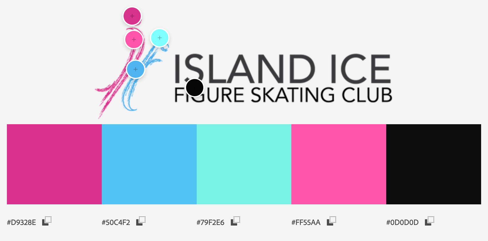
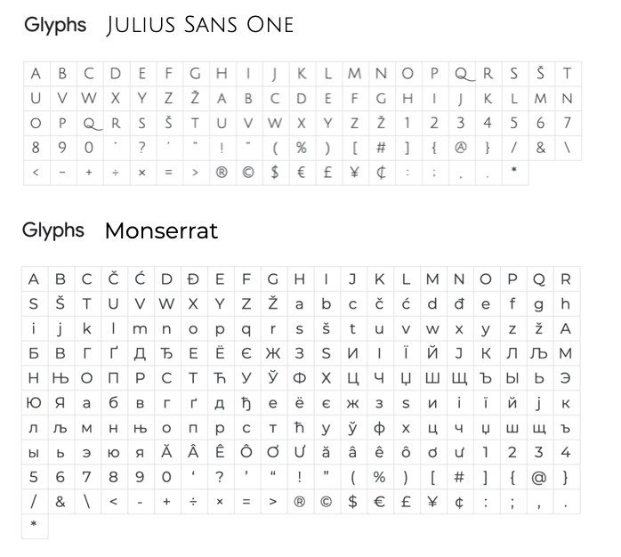

## Code Institute Milestone Project 2 - Interactive Front-end Development

### Athlete Development Profiling Tool

This project aims to quantify a figure skater's development as an athlete for high performance pathway through profiling. It will allow individual skaters to map out their own progress goals with coaches' guidance whilst highlighting possible improvement areas. It is also a visualization tool for skaters to be more aware of their strong components vs. weak components for a better understanding of on ice performance.

The following are the stakeholders:
1. Skaters / Skater's Parents
2. Skater's Coach

#### Island Ice Figure Skating Club (IIFSC) - Background
Island Ice Figure Skating Club is a social ice skating club formed to provide support to our figure skater members and families. IIFSC focuses on building rapport, camaraderie and harmony within the ice skating community by initiating and organizing a variety of activities that promotes such values through fun/play. IIFSC believes that it takes a village to raise a child and aims to create a strong tribe to support each and every individual skater (and family) to reach their individual skating goals. IIFSC logo represents the blades and scratch lines made when a figure skater draws/cuts an image on ice. Both blades were chosen in pink and blue to signify gender neutrality whislt one being larger than the other as a representation of a parent/educator/coach and child/student.

IIFSC is also the home club for a number of Singapore's National Squad team members. This profiling tool was built to provide support for squad athletes; while also providing awareness and opportunity for recreational and competitive skaters geared towards high performance.

#### Sports & Exercise Science - NAPFA - Background
Singapore launched The National Physical Fitness Award/Assessment (NAPFA) in 1982. It is an assessment of physical fitness conducted biannually which involves the following components:
1. 2.4km Walk-Run
2. Sit-Ups
3. Pull-Ups/Push-Ups/Inclined Pull-Ups
4. Sit-and-Reach
5. Shuttle Run
6. Standing Broad Jump

NAPFA standards were used to develop an adapted version for our profiling standards as figure skating demands [sport specific skills](OOI_suiping_FAT_SA1.pdf). The 3 most critical fitness component domains for figure skating are listed below. More information can be found [here](https://suipingooi.github.io/iifscpt/info/) whilst the standards developed can be found [here](scoresheet.xlsx).
```
1. Agility, Balance and Coordination
2. Power and Strength
3. Flexibility
```
Assessment stations selected took into consideration limited access to sport science lab and equipment. As such, these assessment can be conducted by high level athletes themselves at home or anywhere by a coach with just a measuring tape, marker and a phone with timer.

### UX - User Experience


```
```


IIFSC base colors were used for uniformity across the site for a strong DNA connection with users to strenghten their relationship with IIFSC. Sport skill component domains are color coded for easy referencing. Color selection is based on color pyschology skewed towards asian associations but adjusted to match IIFSC base colors.
```
1. #79F2E6 : Agility, Balance and Coordination
    BLUE denotes stability, balance, and harmony
2. #FF55AA : Power and Strength
    PINK symbolizes unconditional love and support.
    RED symbolizes power and energy.
3. rgb(251, 233, 170) : Flexibility
    YELLOW is associated with spontainety and flexibility.
4. BLACK symbolizes elegance and sophistication.
```


```
Julius Sans One and Montserrat (san-serif family) were 
selected as font-pair for this project to portray IIFSC's 
lean yet no nonsense approach towards setting a higher 
bar for the figure skating community.
```
A demo of the site can be found here [https://suipingooi.github.io/iifscpt/](https://suipingooi.github.io/iifscpt/)

## Built With 
### Technologies
1. HTML 5.0 + CSS
2. Bootstrap 4.0 - CSS & JS [https://getbootstrap.com/](https://getbootstrap.com/)
3. JQuery.JS [https://jquery.com/](https://jquery.com/)
4. Restdb.io [https://restdb.io/](https://restdb.io/)
5. Chart.JS [https://www.chartjs.org/](https://www.chartjs.org/)

### Styling
1. Google Fonts [https://fonts.google.com/](https://fonts.google.com/)
2. Gimp 2.10 [https://www.gimp.org/](https://www.gimp.org/) 
3. Adobe Color [https://color.adobe.com/](https://color.adobe.com/)


### Testing
[JSHint](https://jshint.com/) testing was done for script.js. All warnings dealt with.

[W3C Validator](https://validator.w3.org/) testing was done for all html files. All errors corrected and suggestion for language included. 

[Jigsaw CSS Validator](https://jigsaw.w3.org/css-validator/) testing was done for css file. No error was found.

## Features
### Existing Features
1. Tab folder navigation bar for easy access.
2. Info page for parents and aspiring high perfomance athletes for self assessment.
3. Profile card view on index landing page for coaches.
4. Visual representation of chart and score banding with raw data included.
5. Color coded domains across the site for easy reference.
6. IIFSC logo reloads to main index page.
7. IG account link for recent news and activities by the club.

### Features left to Implement
1. A login ID for coaches and skaters to protect individual skater's datasets and privacy as high performance pathway is extremely competitive.
2. Photo of skaters on profile cards.
3. 

## Deployment

## Credits
Island Ice Figure Skating Club (IIFSC) for all the support provided in the development of this diagnostic tool

#### Content
NAPFA
#### Media
1. IIFSC logo from IIFSC 
2. IIFSC color chart from [AdobeColor](https://color.adobe.com/create/image) retrieved on 31 Dec 2020.
3. IG logo adapted from [Flaticon](https://www.flaticon.com/free-icon/instagram-logo_87390) retrieved on 27 Dec 2020.

## Acknowledgments
1. Ms. Jackie Chin - President, IIFSC
2. IIFSC Executive Committee Members  
    1. Mr. TC Wee
    2. Ms. Angeline
    3. Ms. Priscilla
    4. Ms. Cindy
3. Ms. Genevieve Har - IIFSC Coach